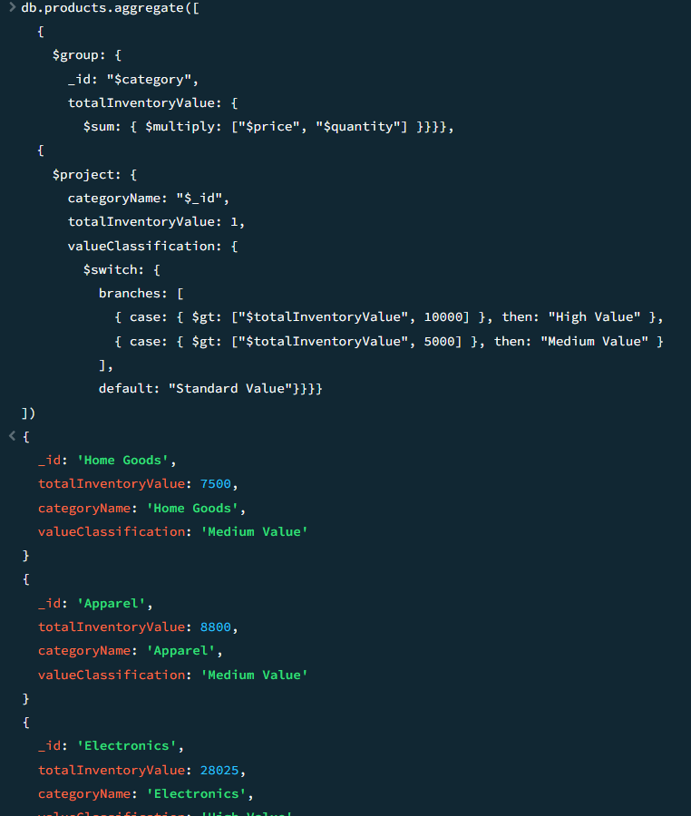
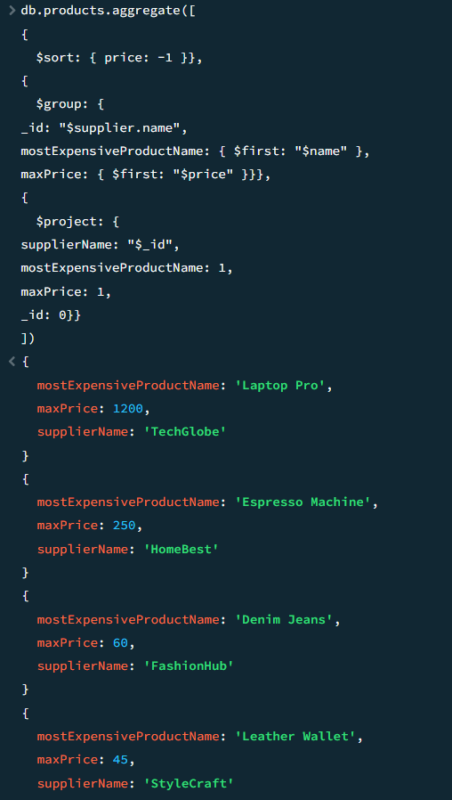
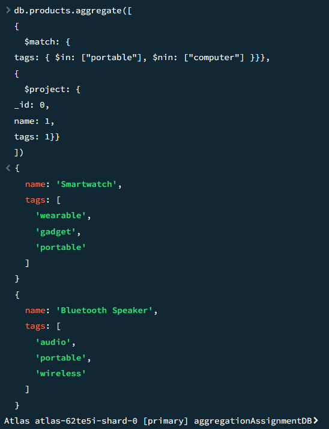

# MongoDB Aggregation Framework Assignment - HARD

# 1. Category Value and Classification:
```
db.products.aggregate([
  {
    $group: {
      _id: "$category",
      totalInventoryValue: {
        $sum: { $multiply: ["$price", "$quantity"] }}}},
  {
    $project: {
      categoryName: "$_id",
      totalInventoryValue: 1,
      valueClassification: {
        $switch: {
          branches: [
            { case: { $gt: ["$totalInventoryValue", 10000] }, then: "High Value" },
            { case: { $gt: ["$totalInventoryValue", 5000] }, then: "Medium Value" }
          ],
          default: "Standard Value"}}}}
])
```


# 2. Suppliers and Their Most Expensive Product:
```
db.products.aggregate([
{
	$sort: { price: -1 }},
{
  $group: {
_id: "$supplier.name",
mostExpensiveProductName: { $first: "$name" },
maxPrice: { $first: "$price" }}},
{
  $project: {
supplierName: "$_id",
mostExpensiveProductName: 1,
maxPrice: 1,
_id: 0}}
])
```


# 3. Products with "portable" tag but NOT "computer" tag:
```
db.products.aggregate([
{
  $match: {
tags: { $in: ["portable"], $nin: ["computer"] }}},
{
  $project: {
_id: 0,
name: 1,
tags: 1}}
])
```
