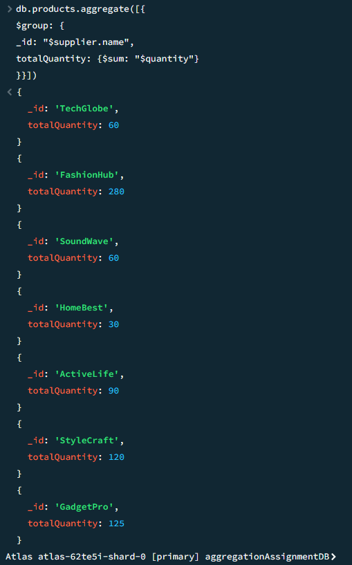
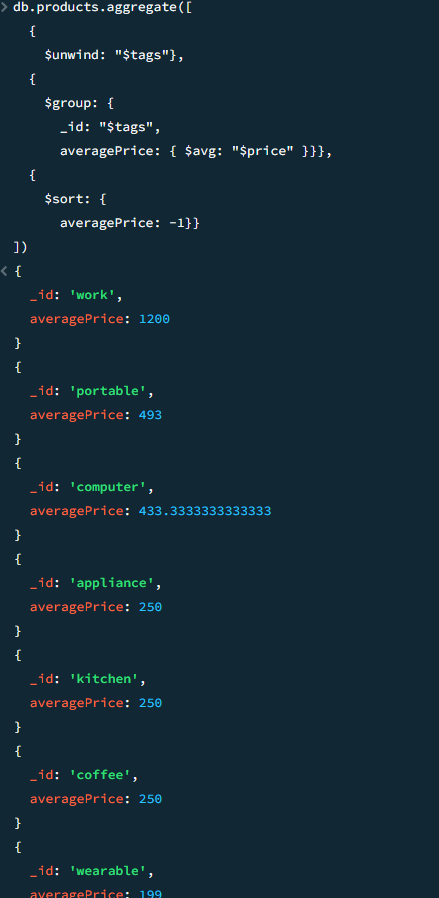
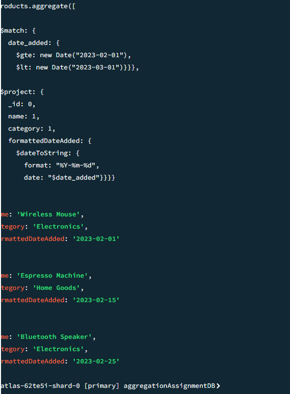

# MongoDB Aggregation Framework Assignment - MEDIUM

## 1. Total Quantity of Products by Supplier:
```
db.products.aggregate([{
$group: {
_id: "$supplier.name",
totalQuantity: {$sum: "$quantity"}
}}])
```


## 2. Average Price of Products per Tag:
```
db.products.aggregate([
	{
    $unwind: "$tags"},
  {
    $group: {
      _id: "$tags",
      averagePrice: { $avg: "$price" }}},
  {
    $sort: {
      averagePrice: -1}}
])
```


## 3. Products Added in February 2023:
```
db.products.aggregate([
  {
    $match: {
      date_added: {
        $gte: new Date("2023-02-01"),
        $lt: new Date("2023-03-01")}}},
  {
    $project: {
      _id: 0,
      name: 1,
      category: 1,
      formattedDateAdded: {
        $dateToString: {
          format: "%Y-%m-%d",
          date: "$date_added"}}}}
```

